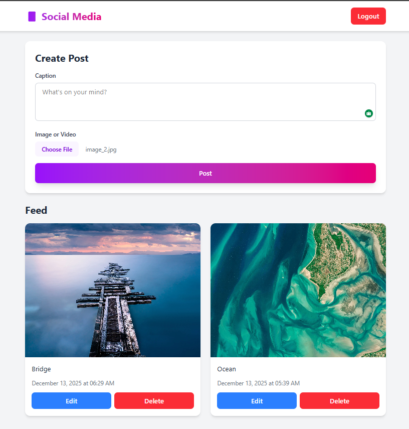

# Social Media Application

A full-stack social media application built with FastAPI (backend) and React + TypeScript (frontend).

## Screenshots

### Login/Register Page


### Feed with Posts


## Features

- 🔐 User authentication (Register/Login with JWT)
- 📸 Upload images and videos to ImageKit
- ✏️ Edit post captions and media
- 🗑️ Delete posts
- 📱 Responsive and modern UI with TailwindCSS
- 🔄 Real-time feed updates

## Tech Stack

### Backend
- **FastAPI** - Modern Python web framework
- **SQLAlchemy** - ORM for database operations
- **SQLite** - Database (async with aiosqlite)
- **Passlib** - Password hashing
- **JWT** - Token-based authentication
- **ImageKit** - Media file storage

### Frontend
- **React 18** - UI library
- **TypeScript** - Type safety
- **Vite** - Build tool
- **TailwindCSS** - Styling
- **Axios** - HTTP client
- **React Router** - Client-side routing

## Project Structure

```
social_media_fastapi/
├── app/                    # Backend
│   ├── app.py             # Main FastAPI application
│   ├── db.py              # Database models
│   ├── schemas.py         # Pydantic schemas
│   ├── auth.py            # Authentication logic
│   └── images.py          # ImageKit configuration
├── frontend/              # React frontend
│   ├── src/
│   │   ├── components/    # React components
│   │   ├── pages/         # Page components
│   │   ├── services/      # API services
│   │   └── types/         # TypeScript types
│   └── package.json
└── README.md
```

## Getting Started

### Prerequisites

- Python 3.9+
- Node.js 16+
- npm or yarn
- ImageKit account (for media storage)

### Backend Setup

1. **Create and activate virtual environment:**
```bash
python -m venv .venv
# On Windows:
.venv\Scripts\activate
# On Mac/Linux:
source .venv/bin/activate
```

2. **Install dependencies:**
```bash
pip install -r requirements.txt
```

3. **Configure environment variables:**

Create a `.env` file in the root directory:
```env
# ImageKit credentials
IMAGEKIT_PRIVATE_KEY=your_private_key
IMAGEKIT_PUBLIC_KEY=your_public_key
IMAGEKIT_URL_ENDPOINT=your_url_endpoint

# JWT secret
SECRET_KEY=your_secret_key_here
```

4. **Run the backend:**
```bash
uvicorn main:app --reload
```

The API will be available at http://localhost:8000

API documentation: http://localhost:8000/docs

### Frontend Setup

1. **Navigate to frontend directory:**
```bash
cd frontend
```

2. **Install dependencies:**
```bash
npm install
```

3. **Start the development server:**
```bash
npm run dev
```

The app will be available at http://localhost:5173

## API Endpoints

### Authentication
- `POST /auth/register` - Register a new user
- `POST /auth/login` - Login and receive JWT token

### Posts
- `POST /upload` - Upload a new post (requires auth)
- `GET /feed` - Get all posts (requires auth)
- `PUT /posts/{post_id}` - Update a post (requires auth)
- `DELETE /posts/{post_id}` - Delete a post (requires auth)

## Usage

1. **Start the backend server** (on port 8000)
2. **Start the frontend dev server** (on port 5173)
3. **Open your browser** to http://localhost:5173
4. **Register** a new account
5. **Login** with your credentials
6. **Start posting** images and videos!

## Features in Detail

### Authentication
- Secure password hashing with bcrypt
- JWT token-based authentication
- Protected routes on both frontend and backend

### Media Upload
- Support for images and videos
- Files uploaded to ImageKit CDN
- Automatic file type detection
- Preview before posting

### Post Management
- Create posts with captions
- Edit captions and replace media
- Delete posts with confirmation
- Chronological feed display

### UI/UX
- Modern gradient design
- Responsive layout (mobile & desktop)
- Loading states and error handling
- Smooth transitions and animations

## Development

### Backend Development
```bash
# Run with auto-reload
uvicorn main:app --reload

# Run tests
pytest
```

### Frontend Development
```bash
cd frontend

# Start dev server
npm run dev

# Build for production
npm run build

# Preview production build
npm run preview
```

## Environment Variables

### Backend (.env)
- `IMAGEKIT_PRIVATE_KEY` - ImageKit private key
- `IMAGEKIT_PUBLIC_KEY` - ImageKit public key
- `IMAGEKIT_URL_ENDPOINT` - ImageKit URL endpoint
- `SECRET_KEY` - JWT secret key
- `ALGORITHM` - JWT algorithm (default: HS256)

### Frontend (.env)
- `VITE_API_URL` - Backend API URL (default: http://localhost:8000)

## Contributing

Feel free to submit issues and enhancement requests!

## License

MIT License
